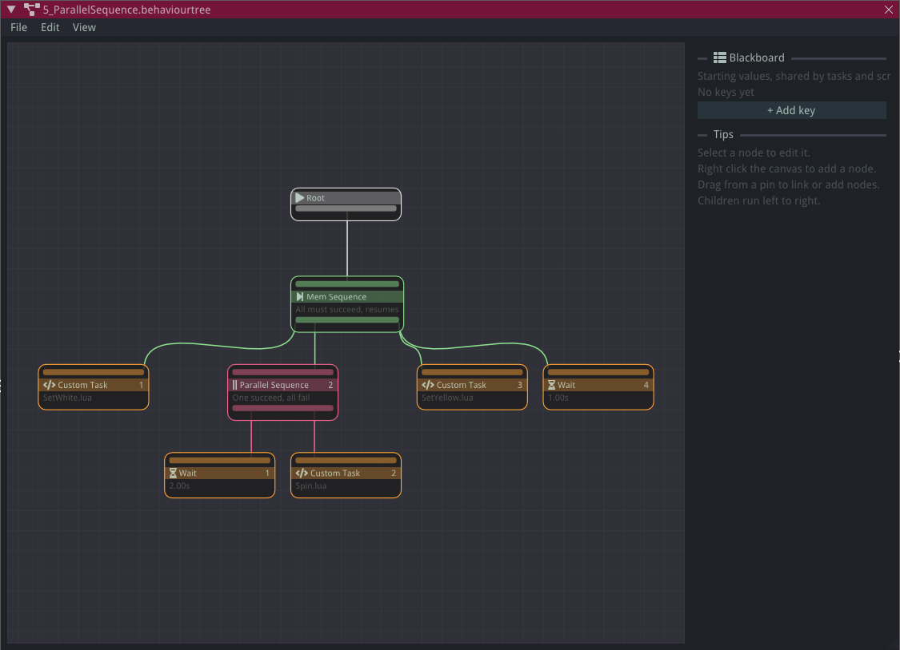

# Behaviour Trees

A behaviour tree describes how an entity makes decisions - patrol until the player is close,
then chase, then attack - as a graph of nodes instead of a long chain of `if` statements in a
script. Trees are `.behaviourtree` files edited visually in the Editor, and any entity with a
`Behaviour Tree` component runs one while the game is playing.

One tree file can drive any number of entities. Each entity gets its own copy of the tree, with
its own node state and its own [blackboard](#the-blackboard), so ten enemies sharing one file
still think independently.

## Creating a tree

1. In the Content Explorer, choose **Create New > Behaviour Tree** and name the file.
2. Double-click it to open the behaviour tree editor.
3. Select an entity, add a **Behaviour Tree** component in the Properties panel, and pick the
   file from its dropdown.

The tree starts running when you press play.

## The editor



The canvas shows the tree top to bottom, starting from the **Root** node. Each node has an input
at the top, where its parent connects, and (unless it's a task) an output at the bottom, where
its children connect.

- **Add a node:** right-click the canvas and pick one from the **Create New Node** menu, or drag
  from a pin into empty space to create a node that's already linked.
- **Link nodes:** drag from a node's output to another node's input. A node has one parent, and
  the Root and decorators have one child, so a new link replaces the old one. Links that would
  make a loop are rejected.
- **Child order:** children run **left to right**. Nodes under a composite show their position
  as a number, and moving a node sideways changes the order.
- **Delete:** select and press `Del`, or right-click a node or link. The Root can't be deleted.
- **Edit a node:** select it and use the panel on the right.
- **Edit the blackboard:** click the canvas background so no node is selected, and the panel
  shows the [blackboard](#the-blackboard) instead.
- **Undo, copy and paste:** the usual shortcuts work, including `Ctrl+D` to duplicate.
- **View menu:** **Zoom to content** fits the whole tree on screen, and **Auto layout** tidies
  every node into a neat tree.

Nodes that aren't connected to the Root are kept in the file when you save, but they don't run.

## How a tree runs

Every frame, the tree is **ticked** from the Root down. Each node it reaches reports one of:

- **Success** - it finished and did what it was meant to.
- **Failure** - it finished and couldn't.
- **Running** - it needs more frames. Next frame it continues where it left off instead of
  starting again.

Composites and decorators decide what to tick next based on their children's results.

When a node is **Running** but its parent stops ticking it - say a higher-priority branch has
taken over - it's **halted**. Halting stops it, tells a custom task script it was interrupted,
and resets it so it starts fresh the next time it's reached.

## Node reference

### Composites

Composites have any number of children and run them in order, left to right.

| Node | Behaviour |
|---|---|
| **Sequence** | Runs children until one fails or is running. Succeeds only if all succeed. Starts from the first child every frame. |
| **Selector** | Runs children until one succeeds or is running. Fails only if all fail. Starts from the first child every frame. |
| **Mem Sequence** | Like Sequence, but resumes from the child it was running instead of starting again. |
| **Stateful Selector** | Like Selector, but resumes from the child it was running. |
| **Parallel Sequence** | Ticks every child every frame. Its settings choose whether it needs all children or just one to succeed (or fail), or a minimum number of each. |

#### Sequence or Mem Sequence?

The plain versions re-check every child before the running one on every frame, which makes them
**reactive**. Use them for conditions guarding an action:

```
Sequence
├── Can see player?     (checked every frame)
└── Chase player        (running)
```

The moment the condition fails, the Sequence fails and the chase is halted.

Use **Mem Sequence** for a routine of steps that each take time - walk here, wait, walk there -
where re-running earlier steps would undo progress. A plain Sequence would keep restarting the
first step. The same split applies to **Selector** (re-check higher priorities every frame) and
**Stateful Selector** (stick with the current choice).

### Decorators

Decorators have one child and change when it runs or what its result means.

| Node | Behaviour |
|---|---|
| **Inverter** | Swaps its child's success and failure. |
| **Succeeder** | Runs its child, then succeeds whatever the result. |
| **Failer** | Runs its child, then fails whatever the result. |
| **Repeater** | Ticks its child every frame and stays running - forever, or until it has ticked it a set number of times (the Limit), then succeeds. |
| **Until Success** | Keeps running its child until it succeeds. |
| **Until Failure** | Keeps running its child until it fails, then succeeds. |
| **Blackboard Bool** | Runs its child only if a blackboard bool is set (or not set, if **Is set** is unticked). Otherwise it fails. |
| **Blackboard Compare** | Runs its child only if two blackboard bools are equal (or different, if **Is equal** is unticked). Otherwise it fails. |

A decorator with no child fails.

### Tasks

Tasks are the leaves of the tree - they're what actually does something.

| Node | Behaviour |
|---|---|
| **Wait** | Runs for a set time, then succeeds. |
| **Random Wait** | Runs for a random time between a minimum and maximum, then succeeds. |
| **Custom Task** | Runs a Lua script - see [Custom task scripts](#custom-task-scripts). |
| **Set Blackboard** | Sets a blackboard key to a value, then succeeds. |
| **Emit Signal** | Sends a [signal](lua-scripting.md#communicating-between-entities-with-signals) with this entity as the sender, then succeeds. The signal's data table is empty. |

## The blackboard

The blackboard is the tree's shared memory: named values that nodes and scripts read and write.
Keys can be a **Bool**, **Int**, **Float**, **Double**, **String**, **Vec2** or **Vec3**.

The Blackboard panel sets each key's **starting value**. When play starts, every entity's tree
begins from those values, and changes made during play only affect that entity.

You don't have to list every key: reading a key that hasn't been set returns `false`, `0` or an
empty string, so a script can create a key just by setting it. Listing keys in the panel gives
them a starting value, and lets the Blackboard Bool, Blackboard Compare and Set Blackboard nodes
pick them from a dropdown instead of relying on typing the name right.

!!! note
    The two blackboard decorators only work with bools. To branch on a number or string, set a
    bool from a script (for example, `Blackboard:SetBool("LowHealth", health < 30)`), or write a
    custom task that returns Success or Failure.

## Custom task scripts

A **Custom Task** runs a Lua script with these optional functions:

```lua
function OnStateEntry()
    -- Runs when the task starts
end

function OnStateUpdate(deltaTime)
    -- Runs every frame while the task is active
    -- Return NodeStatus.Success, NodeStatus.Failure or NodeStatus.Running
    return NodeStatus.Success
end

function OnStateExit(status)
    -- Runs when the task finishes, with its final status
    -- Gets NodeStatus.Aborted if the tree interrupted it while it was running
end
```

If a script has no `OnStateUpdate`, the task succeeds straight away.

Task scripts have three globals:

- `CurrentEntity` - the entity whose Behaviour Tree component is running this tree
- `CurrentScene` - the currently loaded scene
- `Blackboard` - this entity's blackboard

Variables at the top of a script belong to that one task on that one entity, so a timer or
counter isn't shared with other enemies using the same tree.

```lua
-- Succeeds once the player is within range
local RANGE = 3.0

function OnStateUpdate(deltaTime)
    local player = CurrentScene:FindEntity("Player")
    if not player then
        return NodeStatus.Failure
    end

    local offset = player:GetTransformComponent().Position - CurrentEntity:GetTransformComponent().Position
    if offset:Length() <= RANGE then
        return NodeStatus.Success
    end
    return NodeStatus.Failure
end
```

Use `OnStateExit` to clean up anything the task started, like stopping movement. Because it also
runs when the task is interrupted, this cleanup happens even if another branch takes over:

```lua
function OnStateExit(status)
    CurrentEntity:GetRigidBody2DComponent():SetLinearVelocity(Vec2.new(0, 0))
end
```

### Sharing state with an entity's own script

An entity's regular Lua script can reach the same blackboard through its Behaviour Tree
component. This is how a script and a tree coordinate - for example, a health script telling the
tree the entity is hurt:

```lua
local blackboard = nil

function OnCreate()
    local behaviourTree = CurrentEntity:GetBehaviourTreeComponent()
    if behaviourTree then
        blackboard = behaviourTree:GetBlackboard()
    end
end

local function TakeDamage()
    if blackboard then
        blackboard:SetBool("Hurt", true)
    end
end
```

A **Blackboard Bool** node on `Hurt` can then stop the rest of the tree while the entity is
hurt.
