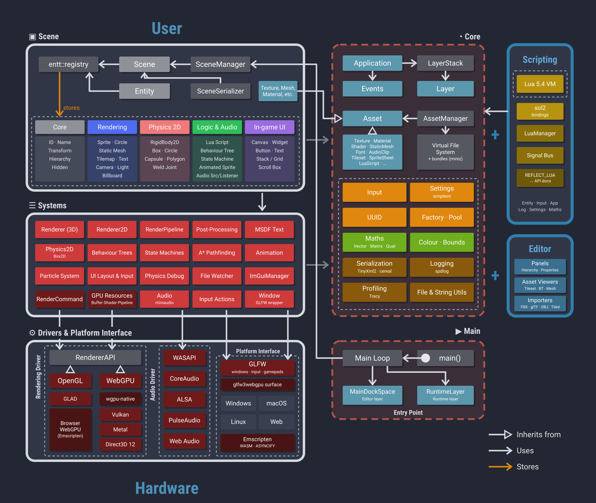

  

# Cross-Platform Game Engine

A cross-platform game engine written in C++, supporting OpenGL and WebGPU rendering backends.

## Features

- Cross-platform rendering, with both OpenGL and WebGPU backends
- Entity-component system (ECS) based scene model, backed by [EnTT](https://github.com/skypjack/entt)
- Editor with a content browser, scene viewport, and asset pipeline (textures, meshes, materials, tilesets, audio)
- 2D and 3D rendering, including sprites, text (MSDF font atlases), and static meshes
- Built-in 2D physics via Box2D
- Lua scripting support
- Visual behaviour tree editor for AI
- Scene and asset serialization

## Architecture

## Where to go next

- [Getting Started](getting-started.md) - creating a project and exporting a game with the Editor
- [Behaviour Trees](behaviour-trees.md) - building AI decisions visually, and scripting custom tasks
- [Lua Scripting](lua-scripting.md) - worked examples for giving entities behaviour
- [Components](Components/index.md) - what each component does, its scene file format and its Lua API
- [Scene Files](scene-files.md) - the `.scene` XML format, for writing or generating scenes by hand
- [Lua API Reference](LuaAPI/index.md) - the full scripting API, generated directly from the engine's source
